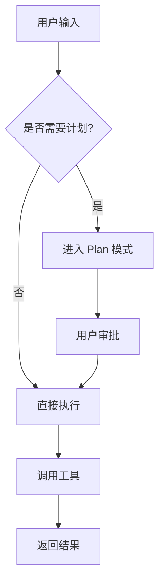
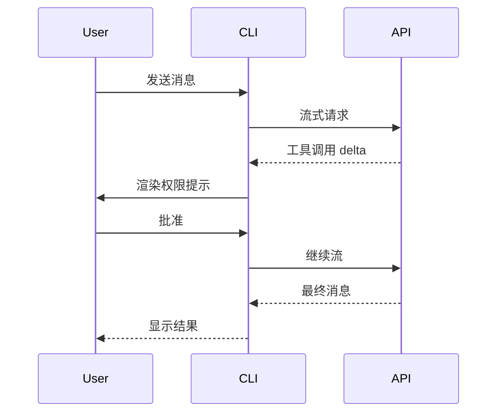
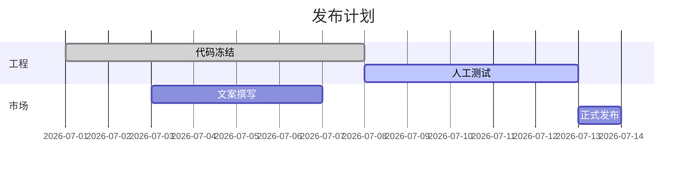

# 全功能 Markdown 测试

这份文档用于人工验证 `artifact` 工具对 `.md` 文件的上传、转换、代码高亮与 Mermaid 渲染是否正常。**直接把它传给 `artifact` 工具**（`file_path` 指向本文件），浏览器打开返回的 URL 即可对照下面的章节逐一确认。

## 行内格式

正文段落里包含 **粗体**、*斜体*、~~删除线~~、`行内代码`、以及组合 **粗体 + _斜体_ + `code`**。还有 [一个链接](https://example.com) 指向 example.com。

支持中英文混排：Claude Orange `#D77757` 是 Anthropic 的主色。Emoji：🚀 ✅ 🎯。

## 标题层级

以下是 H2，再往下还有 H3 / H4 / H5 / H6：

### H3 — 第三层
#### H4 — 第四层
##### H5 — 第五层
###### H6 — 第六层

## 列表

无序列表：

- 第一项
- 第二项
  - 嵌套项 A
  - 嵌套项 B
    - 更深一层
- 第三项

有序列表：

1. 第一步
2. 第二步
   1. 子步骤 2.1
   2. 子步骤 2.2
3. 第三步

任务列表（GFM）：

- [x] 已完成项
- [ ] 未完成项
- [ ] 另一个未完成项

## 表格

左对齐 / 居中 / 右对齐混合：

| 名称       | 类型     | 数量 | 备注           |
| ---------- | :------: | ---: | -------------- |
| Claude     | 模型     |    1 | 推荐           |
| Opus 4.7   | 模型     |    2 | 最强           |
| Haiku 4.5  | 模型     |    3 | 最快           |

## 围栏代码块（语法高亮）

TypeScript：

```ts
interface User {
  id: string
  name: string
  role: 'admin' | 'guest'
}

export async function fetchUser(id: string): Promise<User> {
  const res = await fetch(`/api/users/${id}`)
  if (!res.ok) throw new Error(`status ${res.status}`)
  return (await res.json()) as User
}
```

Python：

```python
from dataclasses import dataclass
from typing import Iterable

@dataclass
class Point:
    x: float
    y: float

def centroid(points: Iterable[Point]) -> Point:
    pts = list(points)
    n = len(pts)
    return Point(sum(p.x for p in pts) / n, sum(p.y for p in pts) / n)
```

Bash：

```bash
# Install dependencies and run tests
bun install
bun run precheck
```

JSON：

```json
{
  "name": "claude-code-best",
  "version": "2.2.1",
  "runtime": "bun",
  "features": ["buddy", "bridge_mode", "ultrathink"]
}
```

## Mermaid 图表

流程图：



时序图：



甘特图：



## 引用

> 这是一段引用文本。
> 第二行继续。

> 嵌套引用：
>
> > 这是更深层级。
>
> 回到外层。

## 水平线

---

水平线之上。

## 行内 HTML

直接写的 HTML 会被透传：<kbd>Ctrl</kbd> + <kbd>C</kbd>，<span style="color: #D77757">Claude Orange 文字</span>。

## 结论

如果上面所有章节都正常显示，说明 artifact 工具的 Markdown 转换、代码高亮（highlight.js）、Mermaid 渲染均已就绪。
